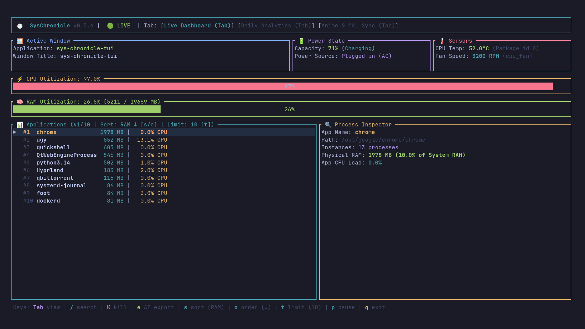
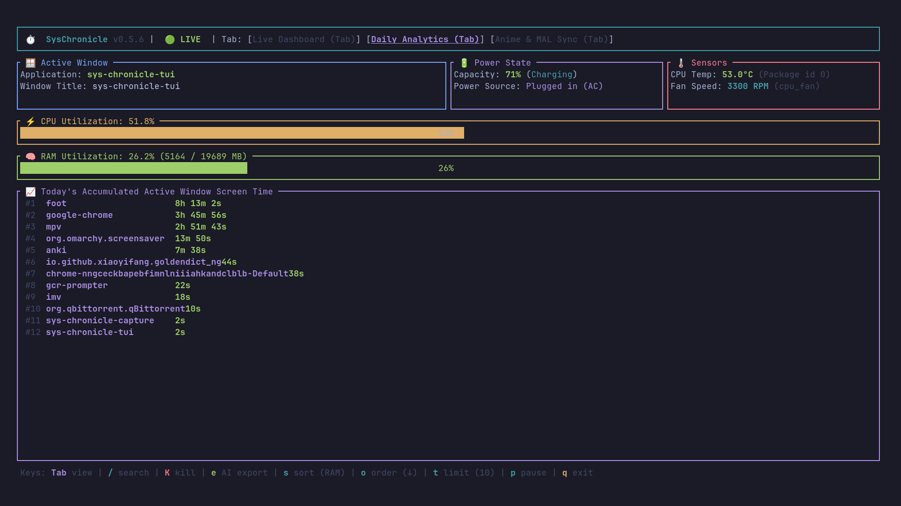
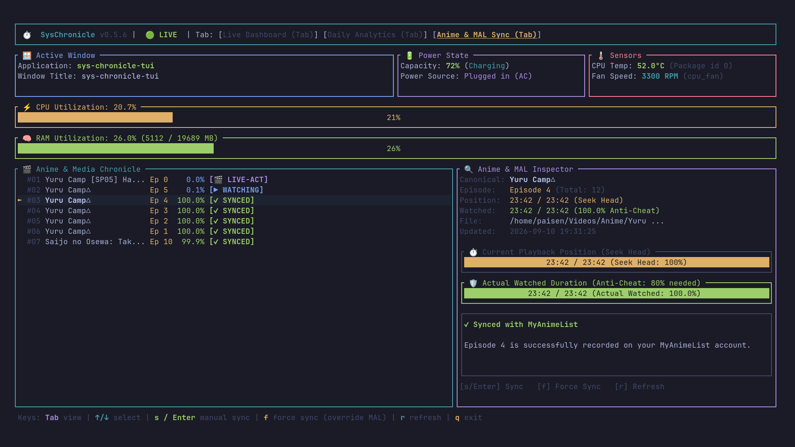
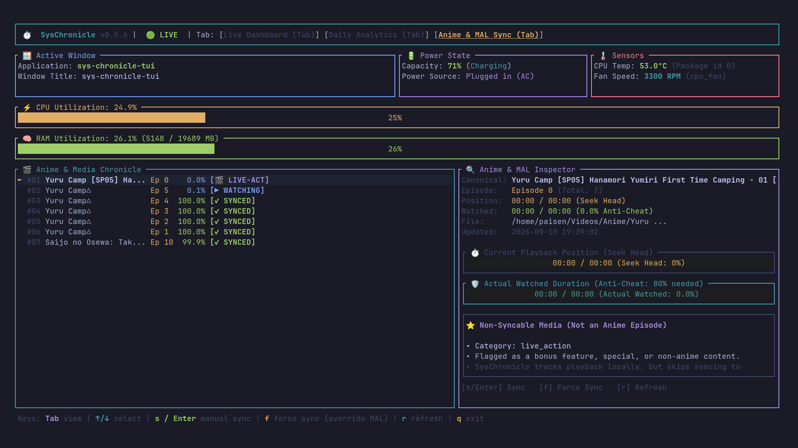

# sys-chronicle ⏱️

> **High-Performance System Activity Logger, Interactive TUI Explorer & AI Context Generator for Arch Linux & Wayland**

[](https://github.com/Praveensenpai/sys-chronicle/releases)
[](LICENSE)

`sys-chronicle` is an ultra-lightweight (~10 MB RAM) Rust background daemon and feature-packed Ratatui TUI dashboard that tracks active window focus, system power states, CPU/RAM utilization, CPU temperature, fan speed, and process metrics into daily JSON Lines logs, formatted into instant AI-digestible Markdown reports.

---

## ❓ The Problem & Why You Need `sys-chronicle`

1. **"What did I actually spend time on today?"**
   - Traditional system monitors (`htop`, `btop`) show instant CPU spikes, but leave no persistent record of your actual window focus history or screen time throughout the day.
2. **AI Assistance Needs High-Fidelity Context**
   - When asking AI agents (Antigravity, Claude, ChatGPT, Gemini) to analyze your daily productivity, debug a system crash, or write daily progress digests, you lack exact timestamped evidence of what applications were open and what system resources were consumed.
3. **Heavy Trackers Drain Battery & RAM**
   - Electron-based time trackers consume hundreds of megabytes of RAM and heavy CPU polling. `sys-chronicle` uses event-driven Unix socket IPC for **0-CPU overhead** window logging.

---

## 💡 How `sys-chronicle` Solves It

- 🪟 **Reliable Hyprland Focus Logging**: Listens directly to Hyprland Wayland Unix socket events (`.socket2.sock`), reconciles the active window every five seconds, and finalizes the active session during a clean shutdown.
- 🔎 **Focused vs. Running Context**: AI exports distinguish focused-window time from applications observed in periodic process samples, so long-running IDEs remain visible when focus events are noisy.
- 📊 **Interactive TUI Dashboard**: Real-time process inspector, CPU temperature/fan-speed sensor panel, fuzzy search (`/`), metric sorting (`s`/`o`), process kill modal (`K`), and screen-time analytics tab (`Tab`).
- 🤖 **1-Keypress AI Clipboard Export (`e`)**: Formats today's activity timeline into Markdown and pipes it straight into your Wayland clipboard (`wl-copy`).
- ⚙️ **Automated Systemd Integration**: Managed as a background user daemon (`sys-chronicle.service`) using ~10 MB RAM.
- 💾 **Lightweight JSONL Storage**: Saves rolling daily logs to `~/.local/share/sys-chronicle/logs/activity-YYYY-MM-DD.jsonl` (~3.6 MB/day).

---

## 🖥️ Interactive TUI Dashboard & Keyboard Shortcuts

Launch the dashboard anytime with:
```bash
sys-chronicle status
```

### 📸 Visual Showcase

<div align="center">

#### ⚡ Tab 1: Real-Time Live System Dashboard
*Live CPU & RAM utilization gauges, hardware sensor telemetry (Package Temp & Fan RPM), active Wayland window focus, and interactive process inspector.*



<br>

#### 📊 Tab 2: Daily Accumulated Screen Time Analytics
*Automated breakdown of active focused window time per application across the day.*



<br>

#### 🎬 Tab 3: Anime Chronicle & MyAnimeList Companion Inspector
*Anti-cheat 80% unique coverage timeline gauge, seek-head vs watched progress tracking, and automated MAL synchronization status.*



</div>

<details>
<summary><b>🧠 View Gemini 3.5 Flash AI Classifier & Non-Anime Extra Detection</b></summary>
<br>

*Intelligent identification of live-action events, voice actress specials, Blu-ray extras, and audio dramas—bypassing MAL sync without polluting watch counts.*

<div align="center">



</div>

</details>

<br>

### ⌨️ Keybindings & Controls

| Shortcut | Action | Description |
| :---: | :--- | :--- |
| **`Tab`** | **Cycle Views** | Cycle across **Live Dashboard** ➔ **Daily Analytics** ➔ **Anime & MAL Sync** |
| **`/`** | **Fuzzy Search** | Filter running applications in real-time as you type *(Live/Analytics)* |
| **`K`** | **Kill Application** | Opens red confirmation modal to terminate selected app processes (`SIGTERM`) |
| **`e`** | **Instant AI Export** | Formats today's activity into Markdown payload and copies to clipboard (`wl-copy`) |
| **`s`** / **`Enter`** | **Sync Anime / Sort** | On Anime tab: manual sync to MAL. On Live tab: toggle RAM/CPU sort |
| **`f`** | **Force Sync Anime** | On Anime tab: opens confirmation modal to force overwrite MAL when MAL is ahead |
| **`r`** | **Refresh Anime** | On Anime tab: reloads playback history from disk |
| **`o`** | **Toggle Sort Order** | Toggle sorting order (**`Descending ↓`** ↔ **`Ascending ↑`**) |
| **`t`** | **Toggle List Limit** | Cycle application limit count (**`10`** ➔ **`25`** ➔ **`All`**) |
| **`p`** | **Pause / Resume** | Freeze live sampling with relative timestamp badge (`⏸️ PAUSED (X ago)`) |
| **`q`** / **`Esc`** | **Exit TUI** | Return to terminal shell |

---

## 🚀 Installation

### One-liner Quick Install
```bash
curl -sSL https://raw.githubusercontent.com/Praveensenpai/sys-chronicle/main/install.sh | bash
```

### From Source
```bash
git clone https://github.com/Praveensenpai/sys-chronicle.git
cd sys-chronicle
cargo build --release
cp target/release/sys-chronicle ~/.local/bin/
```

---

## ⚙️ CLI Usage

```bash
# Launch interactive Ratatui TUI dashboard
sys-chronicle status

# Export activity report for today formatted for AI ingestion
sys-chronicle export

# Copy today's report directly to your clipboard (Wayland)
sys-chronicle export | wl-copy

# Export activity report for a specific date
sys-chronicle export --date 2026-08-10

# Run daemon in foreground (default 5s interval)
sys-chronicle daemon --interval 5

# Install & enable systemd user service
sys-chronicle install-service
```

---

## 🔌 Event-Driven Plugin System

`sys-chronicle` features an asynchronous, non-blocking plugin hook engine. Any executable file placed inside `~/.config/sys-chronicle/plugins/` will automatically receive system activity events formatted as JSON over `stdin`.

### Accurate 80% Watch Threshold Detection
Unlike naive scrobblers that merely check `time-pos / duration >= 0.8` (which falsely triggers if you scrub to the end of a video) or count wall-clock seconds (which inflates if you replay a 2-minute scene 10 times), `sys-chronicle` uses **Unique Timeline Coverage**:
- Continuously merges disjoint playback intervals `[start..end]`.
- Calculates `unique_watched_seconds / video_duration >= 0.80`.
- Once 80% real coverage is reached, emits a single `media_watch_threshold` event and triggers your plugins without spamming.

---

## 🎬 MyAnimeList Companion Scrobbler (`sys-chronicle-mal`)

`sys-chronicle-mal` is an official companion binary that syncs watched anime to MyAnimeList when reaching the real 80% watch threshold in MPV.

### Features
- 🔑 **Official MAL API v2 with PKCE OAuth2**: Secure interactive browser login with zero secret leaking.
- 🧠 **Hybrid Gemini Flash-Lite AI + Regex Parser**: Uses Google's Gemini Flash Lite (`gemini-3.5-flash-lite`) to parse convoluted release group titles (`[SubsPlease] Sousou no Frieren - 04 (1080p).mkv` ➔ Canonical Title: *"Sousou no Frieren"*, Ep `4`). Automatically falls back to an offline regex parser if a Gemini API key is not configured.
- 📊 **Dedicated 3rd TUI Tab (`sys-chronicle status`)**: Switch to the **Anime & MAL Sync** tab (<kbd>Tab</kbd>) to inspect playback progress bars, watch percentages, and sync statuses (`[⏳ WATCHING]`, `[✓ SYNCED]`, `[⏩ MAL AHEAD]`, `[✗ FAILED]`).
- 🛡️ **Ahead-of-MAL Downgrade Guard**: Prevents re-watching earlier episodes (e.g. Episode 4 reaching 80%) from overwriting higher progress already recorded on MyAnimeList (e.g. Episode 6).
- ⚡ **Manual & Force Sync**: Trigger instant sync inside the TUI (<kbd>s</kbd> / <kbd>Enter</kbd>) or via CLI (`sys-chronicle-mal sync <NAME>`), with modal confirmation (<kbd>f</kbd> or `--force`) to override MAL progress when intentional.
- 🔔 **Desktop Notifications**: Sends desktop alerts via `notify-send` when an episode is updated.

### Setup & Usage

```bash
# 1. Connect your MyAnimeList account (and optionally provide Gemini API Key)
sys-chronicle-mal login

# 2. Check connection health and profile status
sys-chronicle-mal status

# 3. Test anime parsing on any video filename
sys-chronicle-mal test "[SubsPlease] Sousou no Frieren - 04 (1080p) [9A1B2C3D].mkv"

# 4. Manually sync an anime title (with optional --force to overwrite MAL)
sys-chronicle-mal sync "Sousou no Frieren"
sys-chronicle-mal sync "Sousou no Frieren" --force

# 5. Link as an active plugin for sys-chronicle (handled automatically by install.sh)
mkdir -p ~/.config/sys-chronicle/plugins
ln -sf ~/.local/bin/sys-chronicle-mal ~/.config/sys-chronicle/plugins/sys-chronicle-mal
```

---

## 🤖 Example Prompt for AI Analysis

Run the export shortcut:
```bash
sys-chronicle export | wl-copy
```

Then paste into your favorite AI prompt:
> *"Here is my sys-chronicle activity log from today. Please analyze my application usage timeline, calculate my active coding vs browsing ratio, and highlight any battery discharge or resource load spikes."*

---

## 📁 Storage & Systemd Service

- **Service Status**: `systemctl --user status sys-chronicle.service`
- **Log Location**: `~/.local/share/sys-chronicle/logs/activity-YYYY-MM-DD.jsonl`

---

## 📄 License

[MIT License](LICENSE)
